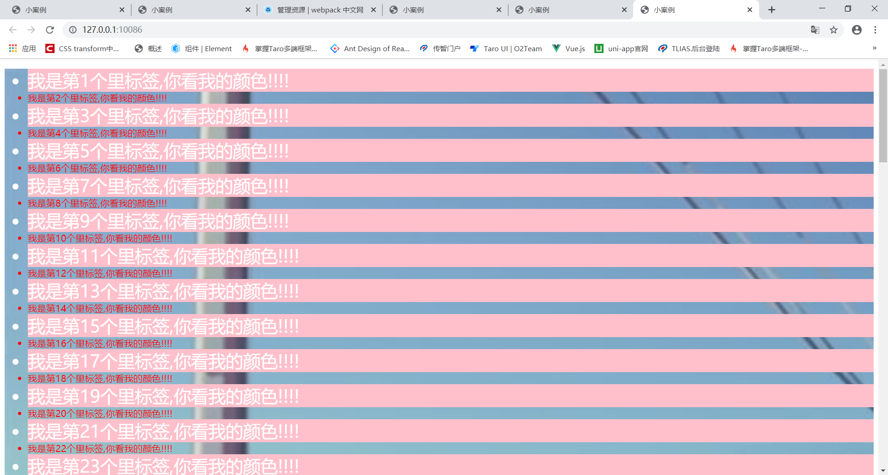

# webpack

**`目标`**：

1. 能够安装webpack
2. 能够配置打包模式、入口和出口文件
3. 能够编译index.html模板页面
4. 能够配置实时打包功能
5. 能够安装配置使用css相关loader
6. 能够安装配置使用less相关loader
7. 能够安装配置使用img相关loader
8. 能够安装配置使用babel相关loader
9. 能够安装配置 使用 Vue相关的loader
10. 基本还原一个vue-cli2.0脚手架的设置


## webpack介绍


**`举例`**:一个项目中可以设置许多less文件，每个less文件需要被编译为普通的css文件内容查才可以执行，一个项目中如果有许多less文件，每个都分别编译，工作效率低下,可以用**`webpack`**统一解决!!!

**`举例`**es6/es7内容，项目发布后为了使得全部的浏览器都可以执行该项目(兼容性要更好)，就要对es6、es7的高级内容做降级处理，降级为es5的内容，每个es6或es7的内容逐个降级处理，工作效率低下,可以用**`webpack`**统一解决!!!

webpack：一次性把项目中全部的es6、es7的高级内容降级为es5标准，提高开发效率

* webpack是一个现代JavasScript应用程序的**`模块打包器`**
* webpack本质上是一个帮助开发者完成 开发调试,应用程序打包的**`百宝箱工具`**,其包含众多的插件,模块,可以帮助开发者配置 并编译打包应用程序.
* **`图片资源`**/**`样式`**/**`ES6/ES7`** 高级语法 都可以通过webpack进行 相应的打包,编译.
* 还可以采用webpack-dev-server 进行 开启本地服务, 进行实时打包预览

> 热更新 改变之后  -> 保存 - > 自动更新浏览器内容

* webpack 本身是**`nodejs`**的一个工具框架,所以webpack本质是对于服务器或者本地文件进行操作

## 为什么使用webpack

1. 现在好多网页有着很多的应用，所以它们的`JavaScript`代码比较复杂，当然也有着很多的依赖包，所以为了简化开发的复杂度，前端就出现了很多比较好的实践方法：

   - 模块化，让我们可以把复杂的程序细化为小的文件;
   - 类似于`TypeScript`这种在`JavaScript`基础上拓展的开发语言：使我们能够实现目前版本的`JavaScript`不能直接使用的特性，并且之后还能能装换为`JavaScript`文件使浏览器可以识别；
   
   TS - > 让我们 像写后端一样去写前端
   
```js
   var  a = '张三'   // 弱类型语言
   ```
   
   ```java
   string a = '张三'  // 强类型语言 必须声明变量的类型
   ```
   
   ```js
   var a:string = '张三' // 用ts的方式 写变量
   ```
   
   - `scss`，`less`等`CSS`预处理器
      ......
      等等
   
   这些改进确实大大的提高了我们的开发效率，但是利用它们开发的文件往往需要进行额外的处理才能让浏览器识别,而手动处理又是非常繁琐的，这就为`WebPack`类的工具的出现提供了需求。

## webpack的优点

* **`模块化`**

这个毋庸置疑，`WebPack`本来就可以看做是模块打包机，将项目结构模块化

* **`代码拆分`**

`Webpack` 有两种组织模块依赖的方式，同步和异步。异步依赖作为分割点，形成一个新的块。在优化了依赖树后，每一个异步区块都作为一个文件被打包

* **`Loader`**

`Webpack` 本身只能处理原生的`JavaScript`模块，但是 `loader` 转换器可以将各种类型的资源转换成 `javascript`模块，这样，任何资源都可以成为 `Webpack` 可以处理的模块。比如说`Webpack` 本身是处理不了`css`的，但是它有`css-loader`，将`css`转换成`js`可以处理的模块

* **`智能解析`**

Webpack 有一个智能解析器，几乎可以处理任何第三方库，无论它们的模块形式是 `CommonJS`、 `AMD` 还是普通的 `js`文件。甚至在加载依赖的时候，允许使用动态表达式 `require("./templates/" + name + ".jade")

* **`插件系统`**

插件（Plugins）是用来拓展`Webpack`功能的，它们会在整个构建过程中生效，执行相关的任务。
 `Loaders`和`Plugins`常常被弄混，但是他们其实是完全不同的东西，可以这么来说，`loaders`是在打包构建过程中用来处理源文件的（JSX，Scss，Less..），一次处理一个，插件并不直接操作单个文件，它直接对整个构建过程其作用。
 `Webpack`有很多内置插件，同时也有很多第三方插件，可以让我们完成更加丰富的功能

* **`快速运行`**

`Webpack` 使用异步 `I/O` 和多级缓存提高运行效率，这使得 `Webpack` 能够以令人难以置信的速度快速增量编译

## webpack的工作方式

* Webpack的工作方式是：把你的项目当做一个整体，通过一个给定的**`主文件`**（如：index.js），Webpack将从这个文件开始找到你的项目的所有依赖文件，使用**`loaders`**处理它们，最后打包**`为一个（或多个）`**浏览器可识别的JavaScript文件。


## 隔行换色简单案例

**`目标`**我们想要实现一个简单的隔行换色页面


给许多li标签设置隔行换色效果：

**`步骤`**：

1. 创建项目目录  demo(注意,包名不能叫**`webpack`**)

2. 给项目 创建package.json文件  

   ```bash
   $ npm init  # 初始化一个npm项目 如果不想一项项回车 可以  npm init -y
   ```

3. 在demo目录下 创建src目录,src目录作为我们的源代码目录

4. 安装 jquery 

      ```bash 
$ npm i jquery -S  #  安装到运行时依赖
      ```

5. 在demo目录下创建index.html文件,并在src目录下创建index.js文件

6. 在index.js中实现如下代码

   ```js
   var liHtml = []
   for (var i = 0; i < 100; i++) {
       liHtml.push(`<li >我是第${i + 1}个里标签,你看我的颜色!!!!</li>`)
   }
   $('#app').append(`<ul>${liHtml.join("")}</ul>`)
   $("li:even").css({ background: 'pink', color: '#fff', fontSize: '30px' })
   ```

7. 在index.html 引入 jquery.js 和 index.js

8. 预览index.html

**`计划`**：

**`安装webpack`**，并把index.js  和  jquery.js 两个文件给打包到一个文件里边去


## webpack安装配置

* [官网](<https://webpack.docschina.org/>)

**`步骤`**：

1. 安装,webpack 和脚手架  

   ```bash 
   $ npm i webpack webpack-cli -D  # 开发时依赖
   ```

2. 在package.json中做如下配置:

   

   > package.json内部内容语法是json格式，因此有固定要求
   >
   > 1. 不能写注释
   > 2. 成员名称 与 成员值  都需要通过 双引号 圈选 (不能使用单引号)
   >
   > build可以自定义为其他，但是webpack字眼是固定的  打包命令就是 **`webpack`**

   

   当前步骤完成，那么就可以通过如下指令进行打包处理了

   ```bash
   $ npm run build # 会执行命令 webpack => webpack 就是打包命令
   ```

* 我们执行上述命令会出现下图
* 

* 我们并没有配置 **`入口`** 和**`出口`**之类的东西 ,但是webpack 自己去找了文件,所以webpack在没有任何配置的情况下, src下的index.js文件作为打包的入口,输出目录为dist下的**`main.js`**

## webpack打包实现

**`目标`**：

* 要把项目中的jquery.js和index.js两个文件打包在一起

**`步骤`**：

1. 在src/index.js中 引入jquery，  

     ```js
import  $  from 'jquery'
     ```

2. 执行指令打包  

  ```bash
$ npm  run build
  ```

打包完毕会生成**`dist`**目录，合并文件默认名称为**`main.js`**

**`main.js`**文件内容就是jquery.js和index.js的合成体，但是代码都是优化压缩后的

1. 在应用程序文件 src/index.html中**`去掉`**对于引入 jquery.js 和  src/index.js的引用,
2. 直接引入打包好的**`dist/main.js`**即可


## webpack配置打包模式

**`目标`**给webpack配置打包模式，不配置打包会提示黄色警告

Development(开发环境)      Test(环境)    preProduction(预生产环境)(灰度环境)   Production(正式生产环境)

项目上正式环境之前 都是 dev

webpack 提供了两个模式 development (开发)(代码不会压缩 混淆 不会禁止 console)   production(生产模式)(禁止console debugger)

**`步骤`**：

1. 项目根目录创建webpack配置文件，名称为 **`webpack.config.js`**,这是默认的文件

*  如果你的文件不想叫webpack.config 或者 不想放置在根目录 ,也可以,但是执行打包命令时,需要指定需要打包的文件

* ```bash
  $ webpack --config  ./config/webpack.prod.js
  ```

1. 给webpack.config.js做如下配置

   

   > production： 生产模式，打包的文件是优化压缩的
   >
   > development：开发模式，打包的文件有适当的回车、空白、注释
   >
   > 前期使用development，项目开发完毕即将上线就用production


## webpack配置入口和出口文件

* **`目标`**将隔行换色的案例改成 黑马头条的 样子

项目主模板文件：index.html(类似头条项目的 public/index.html)

项目主入口文件：src/index.js (类似头条项目的 src/main.js)

项目出口文件：dist/main.js (类似头条项目的 dist/js/chunk***.js)


现在我们要对入口和出口文件做配置(变为 头条项目的样子)

入口：src/main.js

出口：dist/chunk.js

步骤：

1. src/index.js文件改名字为  src/main.js

2. 给webpack.config.js做如下配置

   

3. 物理打包 npm run build

   


> 配置入口和出口的代码

```js
  entry: path.resolve('./src/main.js'),  // 表示一个打包文件的入口地址 path.resolve() 会生成一个绝对路径
    output: {
        // output 配置 打包输出的信息
        path: path.resolve('./build'), // 配置输出的目录
        filename: 'app.js' // 配置输出的文件名
    }
```


## webpack编译模板页面

**`目标`**实现html页面中自动引入文件,去除手动方式的引用

* 目前给项目做打包处理，要通过手动方式在html中引入打包好的app.js文件，太笨了

webpack有一个工具，可以实现同时**`打包/(复制)`**html到达**`输出`**目录，并**`自动`**就引入app.js文件，我们要做到的事情就是直接运行打包好的模板文件即可

实现步骤：

1. 安装工具, yarn  add  html-webpack-plugin  -D

      ```bash
$ npm i html-webpack-plugin -D
      ```

2. 在webpack.config.js中配置如下信息：,需要注意的是,这是一个**`插件`**,需要配置在**`plugins`**选项下


```js
   plugins: [
        // 实例化插件,传入构造参数
        new HtmlPlugin({
            // template 的意思是模板的意思  表示 从哪个目录里面 找到要拷贝的模板 然后自动引入文件
            template: path.resolve('./public/index.html') // 找到模板文件
        })
    ]
```

1. 在html模板中不用引入任何的js文件了

2. 做物理打包 npm run build（编译生成模板文件了，并且有自动引入app.js文件）

   


## webpack实时打包

* **`目标`**实现 npm run serve 启动项目 实时打包

**`注意`**：

* 项目开发都是对src目录内部的文件进行更新，不要去修改dist打包好的文件

* 现在对src内部的任何文件做修改操作后，都需要重新打包，才可以看到对应效果

* webpack本身有一个工具，名称为 **`webpack-dev-server`**，可以实现随时修改源文件，浏览器随时看到修改后的效果，不需要反复打包，这样就非常好

* webpack-dev-server安装运行起来之后，会给我们创建一个http的**`web服务`**

步骤：

1. 安装 

```bash
$ npm i webpack-dev-server  -D
```

2. 在webpack.config.js中做如下配置

   ```json
      devServer: {
           // 配置 webpack-dev-server的选项
           host: '127.0.0.1',  // 配置启动ip地址
           port: 10088,  // 配置端口
           open: true  // 配置是否自动打开浏览器
       }
   ```


3. 在package.json中做如下配置


现在通过  **`npm run serve`** 就可以实现 实时打包、实时编译、实时浏览器查看效果了

注意：

1. npm run  serve指令执行后，其是一个“前台”进程，不能关闭
2. 浏览器看到的实时效果是服务器通过“**`内存`**”提供的，没有物理文件，也不会生成dist目录

## webpack-loader-运行css文件

webpack其实本质上只能处理js文件,如果有css文件,只能交给我们的loader去处理

**`目标`**：在当前项目中创建css文件并做引入使用

步骤：

1. 创建css文件    src/styles/index.css，  和简单的样式    

```css
li {
    color: red;
}
```

2. 在main.js中引入css文件  ， 

```bash
import './styles/index.css'
```

此时实时打包**`报错`**了


错误提示：需要一个适当的**`loader`**来处理css文件


### webpack-loader-介绍

webpack很厉害，可以打包处理不同的内容(css/img/less/es6、es7等等)，但是具体处理工作webpack不参与，具体交给手下  loader去处理，loader是小兵，帮助webpack对不同内容做编码、降级处理

准确定义：

webpack本身就是一个**`打包机器`**，其不能对具体代码内容部分进行**处理**(或处理得非常有限)，不同的代码内容(less/scss/ES6(ES7)/image/css等等)需要webpack找到不同的**`loader`**(装载器)实现转码、编译、降级处理。

### webpack-loader-安装配置css相关loader

**`目标`** 安装配置css相关的loader

* css内容相关的loader有：style-loader 和 css-loader

安装配置步骤：

1.  安装, 

 ```bash 
$ npm i css-loader style-loader -D
 ```

2. 在webpack.config.js中做如下配置

```js
   rules: [{
            // 处理css文件
            test: /\.css$/,    // 正则表达式 匹配所有的css文件
            // loader的顺序是非常严格的 先写谁  表示最后执行谁
            // 执行顺序实际上是从右向左
            use: ['style-loader','css-loader']  // use是一个数组 也可以换成loaders style-loader  css-loader
            // css-loader 的功能是 负责 把css文件变成 js文件的一个代码块
            // style-loader 的功能是 负责 把js的代码块变成 html 页面中的一个style标签
        }]
```


1. 现在重新 实时打包  npm  run  serve,发现 css文件的样式已经生效

问：生成好的css内容在哪？

答：css-loader将 css代码 生成了 一个 代码块,生成到了 app.js中

style-loader 将代码块 生成了一个style标签 显示在页面上

之后应用执行时，chunk.js会把css内容通过style标签的形式嵌入的应用文档内部，样式就生效了


```
use: ['style-loader', 'css-loader'],
```

上述两个loader配置有严格的"一前一后"顺序，本质执行时，是css-loader在前、style-loader在后，这是固定特点

注意：

​	webpack给打包处理**独立文件的css**，在index.html模板中设置的行内样式不给处理

## webpack-loader-图片处理和file-loader

**`目标`**：

* 给整个页面设置背景图片 

步骤：

1. 在assets目录下 放置一张背景图片

2. 给#app设置背景图片

3. 在index.css样式文件中给div设置背景图片

   ```
   #app {
       background-image: url('../assets/image/back.jpg');
       background-size: cover;
   }
   ```

4. 现在实时打包报错了

   

   错误说明：图片的引入不ok，需要loader来处理


## webpack-loader-安装配置图片相关loader

**`目标`**  安装配置图片相关的loader

img图片相关的loader有两个：url-loader   和   file-loader

安装配置loader步骤：

1. 安装 ，

   ```bash 
   $ npm i url-loader file-loader -D
   ```

2. webpack.config.js中做具体配置，如下

   

3. 现在重新实时打包 npm run serve，发现页面上已经有背景图片效果了




```js
{
  // 2) 图片处理loader配置
  test: /\.(png|jpg|gif|jpeg)$/i,  // 正则匹配图片文件
  // 遇到图片文件就交给如下loader处理
  use: [
    {
      loader: 'url-loader',
      options: {
        // limit:设定大小阀值
        // a. 被处理图片大小 大于该阀值，就通过物理文件重新生成该图片
        // b. 被处理图片大小 小于等于该阀值，就把图片变为字符串(嵌入到应用文档中，好处是节省一个http资源)
        limit: 8192
      }
    }
  ]
},
```

loader说明：

1. 只配置url-loader，file-loader不用配置，条件满足后url-loader会自动调用file-loader执行
2. limit:8192设置图片判断大小阀值的，一般建议是10k左右，原因是图片变为字符串大小会增加的(过大图片变为字符串我们就没有"利润"了)

```
url-loader: 负责把 小于等于   阀值的图片变为字符串
file-loader: 负责把 大于阀值  的图片重新以物理文件形成生成在dist目录
```

* 我们也可以只用file-loader来处理这类文件,那么所有的文件都会被拷贝到dist目录下,之前处理的字体图标就是把所有的字体图标都拷贝了过去

注意：

​	图片loader只能处理css文件的**背景图片**，而index.html模板中通过img标签做的图片不给处理(只把其当做标签的普通属性了)

### webpack-loader-打包好图片在哪

现在给项目做物理打包：

1. **`小于阈值`**小图片就变为**`base64`**字符串存储，该字符串合并到  chunk.js文件中，应用执行的时候会被通过style标签形式以样式形式呈现
2. **`大于阈值`**大图片就直接生成的dist目录，其是通过具体路径名方式被访问


可以给loader做配置，使得物理图片在dist下的某一个子目录生成出来


> outputPath虽然是file-loader的配置信息，但是可以给url-loader使用，它们内部会有沟通，url-loader会把该参数给到file-loader去使用的

### loader-base64字符串图片说明

webpack把img图片变为字符串后，名称为base64格式字符串

什么是base64格式？

答：Base64就是一种基于**64个可打印**字符来**表示二进制数据**的方法。 

一个图片可以变为二进制数据，该数据再编码为base64格式

## webpack-loader-应用less文件及安装配置less相关loader

**`目标`**安装配置less相关loader

1. 创建 src/styles/second.less文件，并设置简单样式 

  ```css
ul{ 
   li
    {
        border:2px solid orange;
    }
}
  ```

在main.js中引入less文件

```js
import './styles/second.less'

```

此时实时打包报错，告诉less缺少对应loader来处理


loader具体为：less-loader、less

步骤：

1. 安装依赖包

 ```bash 
$ npm  i less-loader  less -D
 ```

2. webpack.config.js做如下配置


3. 现在在重新实时打包运行  npm run serve，发现less设置样式已经生效


### webpack-loader-less相关loader解读

```js
{
  // 3) less处理loader配置
  test: /\.less$/,
  use: ["style-loader", "css-loader", "less-loader"]
},
```

说明：

​	less样式文件处理需要3个loader，具体为上述，它们有严格的顺序，它们有做工作交接

​	它们执行的顺序是颠倒的(less>css>style)

```
style-loader：负责生成style标签，把css样式体现出来，之后该标签嵌入到应用文档中去

css-loader：使得css文件可以通过import引入，并合并到chunk.js中

less-loader: 该loader负责把less文件内容转变为 css内容
```

less样式内容经过loader处理完毕，在哪？

答：在chunk.js中

## webpack-loader-运行es6标准代码,及babel-loader配置

应用es6高级标准技术

步骤：

1. 在main.js中应用es6内容(let、箭头函数、对象解构赋值、...展开运算符、反勾号字符串等等)

   ```js
   import $ from 'jquery'
   import './styles/index.css'
   import './styles/second.less'
   let liHtml = []
   for (var i = 0; i < 100; i++) {
       liHtml.push(`<li >我是第${i + 1}个里标签,你看我的颜色!!!!</li>`)
   }
   let bossName = '陈浩南'
   let strTemplate = `
      <li>我是老大${bossName},都听我的!!!</li>
   `
   let newList = [strTemplate,...liHtml]  // ES6解构赋值
   $('#app').append(`<ul>${newList.join("")}</ul>`)
   $("li:even").css({ background: 'pink', color: '#fff', fontSize: '30px' })
   ```

2. 给项目做物理打包 npm run build

3. 发现情况不好，在chunk.js中生成的内容还是es6高级的信息

   

   > 我们本意是要把es6变为es5的，但是失败了

   

### loader-babel-loader和preset和plugin关键字解读

能够把es6高级内容变为es5的loader名称为 **babel-loader**

实际处理是这样的

es6/es7/es8等等高级标准有很多(let、箭头函数、对象解构赋值、...展开运算符、反勾号字符串等等)，每个标准都需要一个独立的**plugin**进行降级处理，如果使用许多高级标准内容，那么势必要为此安装许多plugin，这样工作比较繁琐，系统已经考虑到这点了，其通过**preset**把许多**常用**的plugin给做了集合，因此一般性的使用只需要安装preset即可搞定(如果项目应用到了一个生僻的高级标准内容，preset处理不来，就还需要再安装对应的plugin处理)

let----降级---->plugin

箭头函数----降级--->plugin

..........


## loader-安装配置loader和preset做降低处理

babel-loader官网：<https://babel.docschina.org/>

步骤：

1. 安装依赖包

   ```bash
   $ npm i babel-loader @babel/core @babel/preset-env -D
   ```

2. 在webpack.config.js中做如下配置：

   

3. 在项目根目录创建 babel.config.js文件，配置如下

   作用：使得babel-loader可以找到preset做代码降级处理

   

4. 现在给项目做物理打包 npm run build,发现高级内容已经降级处理了

   


## webpack-安装配置vue-loader处理单文件组件

* **`目标`** 配置针对.vue相关的loader,完成一个基本的小项目

* 安装vuejs

* ```bash
  $ npm i vue -S
  ```

  * 在src下新建一个App.vue文件 ,写入如下内容

  * ```html
    <template>
      <div class='app'>
         <span>Hello world</span>
      </div>
    </template>
    
    <script>
    export default {
    
    }
    </script>
    
    <style>
    
    </style>
    ```

  * 在main.js引入,main.js代码改为如下代码

  * ```js
    import Vue from 'vue'
    import App from './App.vue'
    
    new Vue({
        render: h => h(App)
    }).$mount("#app")
    ```

  * 执行npm run serve,发现报错!!!!

  * 

* 我们需要安装loader依赖

* ```bash 
  $ npm i  vue-loader  vue-template-compiler vue-style-loader -D
  ```

* . Vue-loader在15.*之后的版本都是 vue-loader的使用都是需要伴生 VueLoaderPlugin的, 所以我们还需要一个操作,安装完毕依赖之后,在配置文件 中 

* 


重新启动发现就OK!!!!


接下来你可以尝试在这个手动建好的配置中开发一些内容了!!!!!